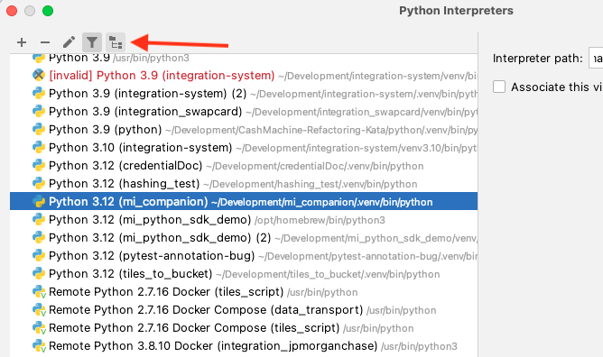
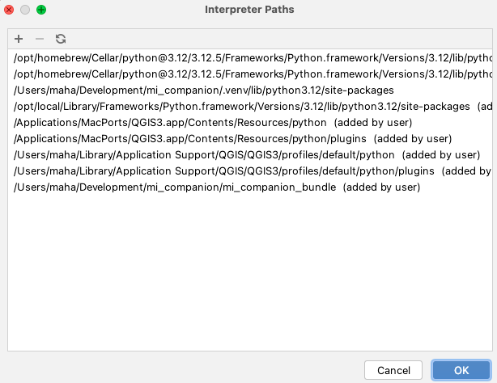

# MI Companion

This plugin is an editor for MI-based data, it provides a direct view into what currently resides in the MI
Database and thus lets you modify and extend it with ease.

## How to setup QGIS development environment for Windows

Find your QGIS shell environment .bat

like this `C:\Program Files\QGIS 3.44.0\OSGeo4W.bat`

execute with "Run as administrator"

cd to the root of this repository and run

`python dev_install_plugin.py`

and you are good to go.

Now just open QGIS and get cracking.

## How to setup editable development environment

Using the interpreter of choice, execute while in the root of this repository

`python dev_install_dependencies.py`

## How to compile resources

install pyside6 if you haven't already

pip install pyside6

then run

`pyside6-rcc -g python -o mi_plugin/resources.py resources.qrc`

and replace in mi_plugin/resources.py

`from PySide6 import QtCore`

with

`from qgis.PyQt import QtCore`

## How to setup python interpreter in pycharm

1. Build mi_plugin_bundle and install. Run `bundle_packaging.py` to build the mi_plugin_bundle. Run
   `dev_install_plugin.py` to install the plugin.
2. Open QGIS and open the Python console. Run

```
import sys
sys.executable
sys.path
 ```

3. Create a new virtual environment interpreter in Pycharm using the path output from `sys.executable` as your
   base interpreter.
   If you're on MacOS you might get the path to the QGIS executable instead, then insert the path to your
   system interpreter as your base interpreter.
4. Click the interpreter paths button when highlighting your newly create interpreter.
   
5. Add all the different paths in the output from `sys.path` to your interpreter.
   There can be duplicates in the output, but you only have to add the once.
   
7. Now you should be able to run the code and tests!
